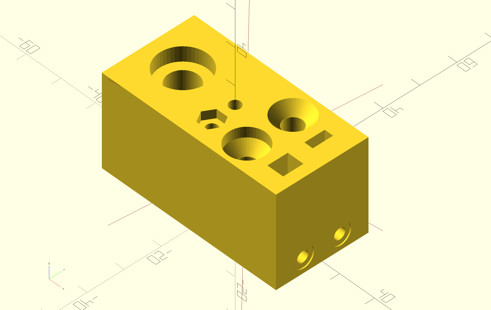
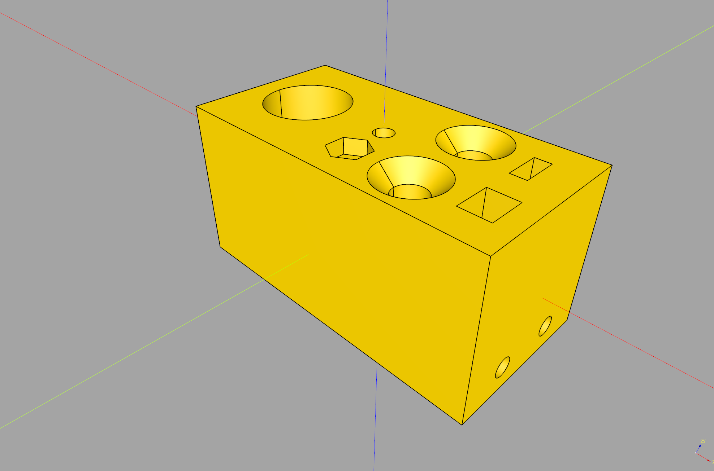
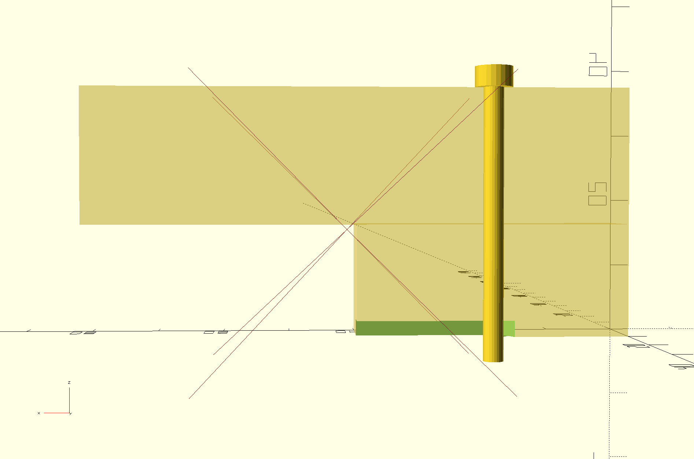
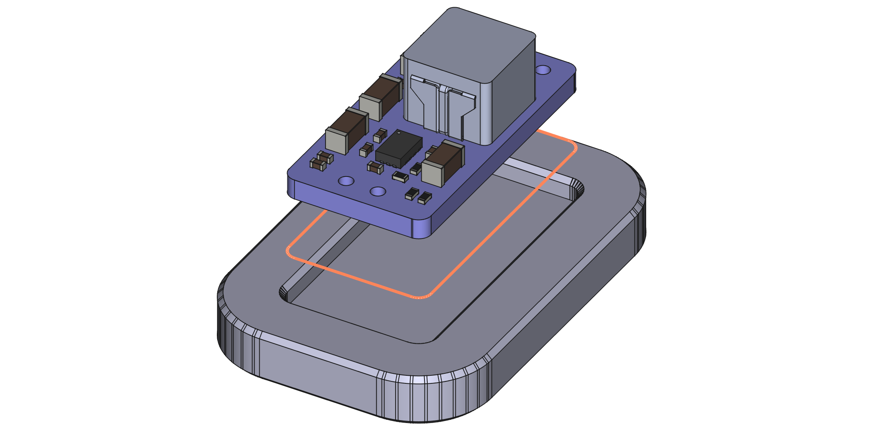
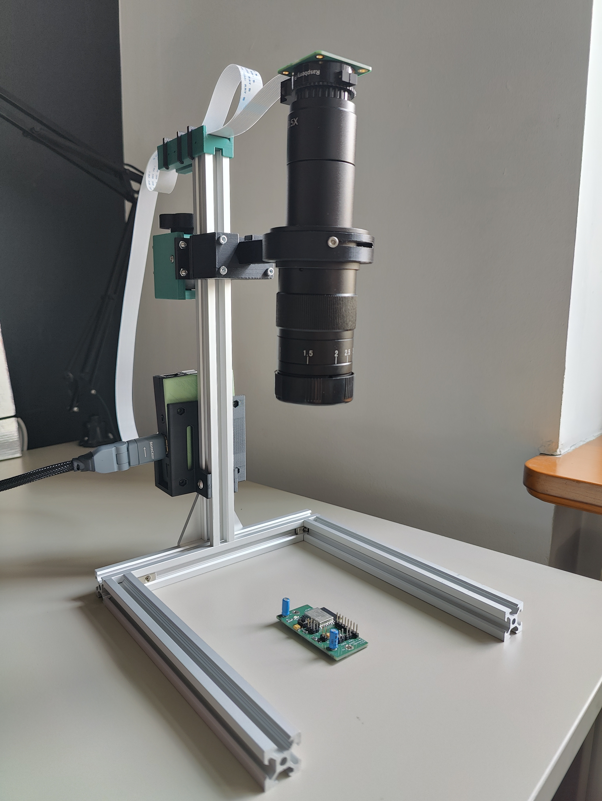
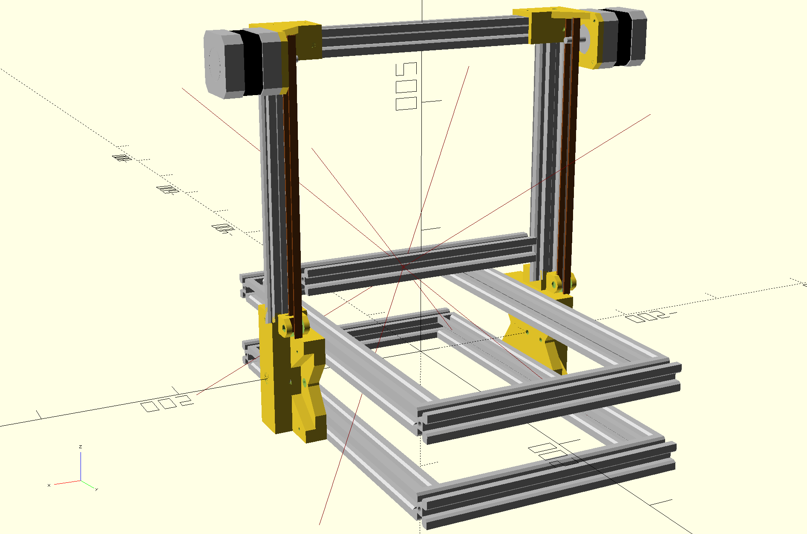
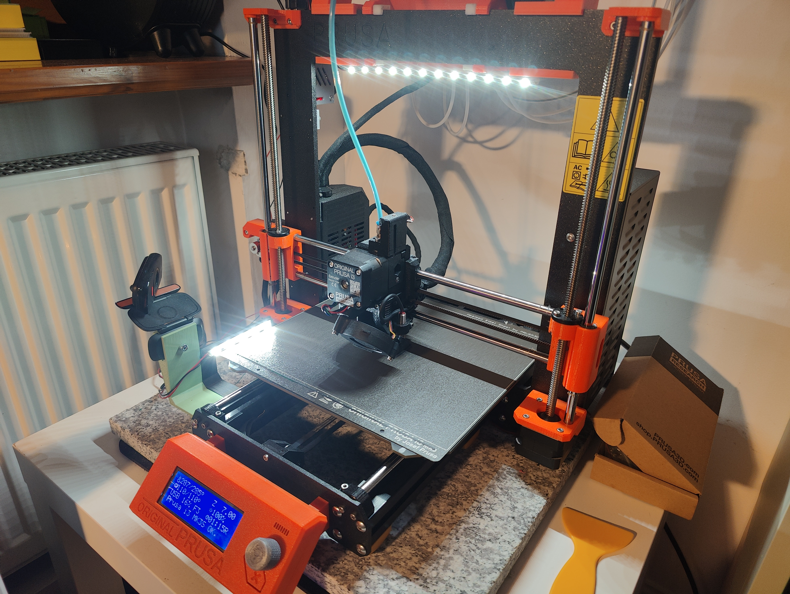
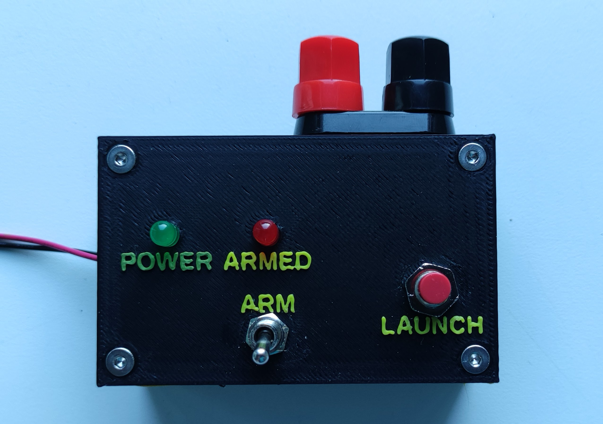
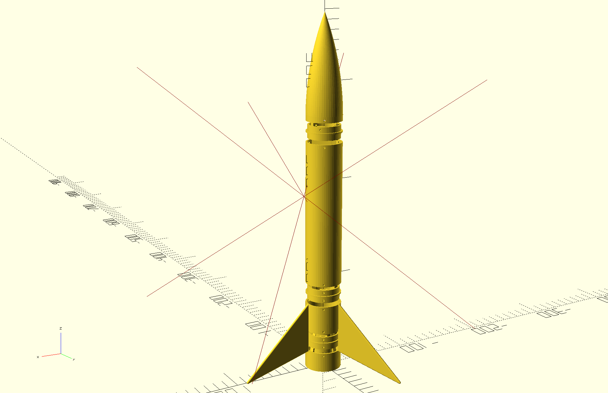

# Hi, I'm Maciej 
<a href="https://github.com/mmalecki/how-do-you-pronounce-maciej/blob/master/maciej.flac">pronouciation</a> / he/him

I'm a site reliability engineer, a maker and a all-around hacker.

## Hobbies & Projects

### Programmers' CADs
CadQuery and OpenSCAD are my CAD tools of choice.

<table border="0">
  <tr>
    <td><a href="https://github.com/mmalecki/catchnhole">catchnhole</a>: an ergonomic way to create nutcatches and bolt holes in OpenSCAD </td>
    <td align="right"></td>
  </tr>
  <tr>
    <td><a href="https://github.com/mmalecki/cq-queryabolt">queryabolt</a>: an ergonomic way to create nutcatches and bolt holes in CadQuery</td>
    <td align="right"></td>
  </tr>
  <tr>
    <td><a href="https://github.com/mmalecki/next-bolt">next-bolt</a>: putting some OpenSCAD Computer Assist into your bolt length choices</td>
    <td></td>
  </tr>
  <tr>
    <td height="125px"><a href="https://github.com/mmalecki?tab=repositories&language=openscad">...and a ton of other OpenSCAD libraries</a></td>
    <td></td>
  </tr>
</table>

### Electronics
<table border="0">
  <tr>
    <td><a href="https://github.com/mmalecki/pcb-jigify">PCB Jigify!</a>: generate holding and testing jigs for your PCBs directly from your PCB files</td>
    <td></td>
  </tr>
  <tr>
    <td><a href="https://github.com/mmalecki/rapiscope">Rapiscope</a>: rack and pinion-adjustable, rapidly 3D-printable, Raspberry Pi-based digital microscope for soldering</td>
    <td align="right"></td>
  </tr>
</table>

### 3D printers

<table border="0">
  <tr>
    <td><a href="https://github.com/mmalecki/the-swoon">The Swoon</a>: a WIP fork of the FoldaRap project intended at upgrading the design with belted Z (✓), linear rails and EVA 3.0 compatibility</td>
    <td align="right"></td>
  </tr>
  <tr>
    <td>Lighting (<a href="https://github.com/mmalecki/prusa-i3-led-strip-mount">top</a>, side), <a href="https://github.com/mmalecki/extrusion-webcam-mount">camera</a> & <a href="https://github.com/mmalecki/prusa-i3-hard-feet">feet</a> setup for my Prusa i3 MK3s+</td>
    <td align="right"></td>
  </tr>
</table>

### Model rocketry
Trying to make model rocketry more accessible and DYI:

<table border="0">
  <tr>
    <td><a href="https://github.com/mmalecki/lc-0">Launch Controller 0</a>: very simple model rocket launch controller</td>
    <td align="right"></td>
  </tr>
  <tr>
    <td><a href="https://github.com/mmalecki/lp-1">Launch Pad 1</a>: launch pad for model rocket based around 2020 aluminium extrusions</td>
    <td align="right"></td>
  </tr>
  <tr>
    <td><a href="https://github.com/mmalecki/sv-entire-thing">SV Entire Thing</a>: small, fully 3D-printed model rocket hull for testing designs</td>
    <td align="right"></td>
  </tr>
</table>

### Mechanical keyboards

* [`qmk_rc`](https://github.com/mmalecki/qmk_rc) and [`qmkrcd`](https://github.com/mmalecki/qmkrcd) - remote control for your QMK-powered keyboard

### SRE/build engineering/...

* [Raspberry Pi pi-gen + Packer](https://blog.mmalecki.com/2022/11/16/pi-gen-and-packer.html) - building custom Raspberry Pi OS images from scratch, with Packer
